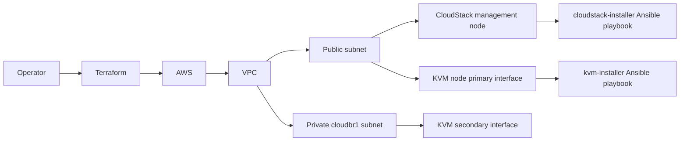

# CloudStack Lab on AWS

Terraform configuration for provisioning a small AWS-based lab used to experiment with Apache CloudStack and a KVM hypervisor node.

This repository is intended for learning, testing, and repeatable infrastructure experiments. It creates AWS networking resources, EC2 instances, security groups, an SSH key pair, and bootstrap steps that invoke the related Ansible installers.

## Architecture



## What it provisions

- VPC, subnets, route table, and internet gateway.
- Security groups for the CloudStack and KVM nodes.
- Ubuntu-based EC2 instances.
- Generated SSH key pair for lab access.
- Bootstrap commands that run the CloudStack and KVM Ansible installers.

## Requirements

- Terraform 1.5 or newer.
- AWS credentials configured locally or through your CI/CD environment.
- Permission to create VPC, EC2, EIP, security group, subnet, and key pair resources.

## Security notes

Terraform state can contain sensitive values, including generated private keys, IP addresses, resource IDs, and provisioner data.

Do not commit:

- `terraform.tfstate`
- `terraform.tfstate.backup`
- `*.tfvars`
- generated private keys such as `*.pem`

For real usage, configure a remote encrypted backend such as S3 with state locking.

The default example restricts SSH and UI access to a placeholder CIDR. Replace it with your own public IP range before running `terraform apply`.

## Quick start

```bash
terraform init
cp terraform.tfvars.example terraform.tfvars
terraform fmt
terraform validate
terraform plan
terraform apply
```

Update `terraform.tfvars` before applying:

```hcl
allowed_ssh_cidr_blocks           = ["YOUR_PUBLIC_IP/32"]
allowed_cloudstack_ui_cidr_blocks = ["YOUR_PUBLIC_IP/32"]
mysql_root_password               = "replace-with-a-secure-value"
mysql_cloud_password              = "replace-with-a-secure-value"
```

## Configuration

| Variable | Description | Default |
| --- | --- | --- |
| `aws_region` | AWS region where resources are created. | `eu-west-1` |
| `key_name` | AWS key pair name. | `cloudstack-key` |
| `ssh_private_key_directory` | Local directory for the generated private key. | `~/.ssh` |
| `vpc_cidr` | VPC CIDR block. | `10.0.0.0/16` |
| `subnet_cidr` | Public subnet CIDR block. | `10.0.1.0/24` |
| `allowed_ssh_cidr_blocks` | CIDR blocks allowed to connect through SSH. | Required |
| `allowed_cloudstack_ui_cidr_blocks` | CIDR blocks allowed to access CloudStack UI ports. | Required |
| `mysql_root_password` | MySQL root password passed to the CloudStack installer. | Required |
| `mysql_cloud_password` | CloudStack database password passed to the installer. | Required |

## Project structure

```text
.
├── main.tf
├── outputs.tf
├── variables.tf
├── terraform.tfvars.example
└── README.md
```

## Related repositories

- [cloudstack-installer](https://github.com/arencibiafrancisco/cloudstack-installer)
- [kvm-installer](https://github.com/arencibiafrancisco/kvm-installer)

## Roadmap

- Add a remote backend example.
- Add Terraform validation through GitHub Actions.
- Add diagrams for network layout and traffic flow.
- Add teardown and troubleshooting notes.

## License

No license file is currently published in this repository. Add a license before promoting the project as open source.
